# System Junk – Portfolio Project 3

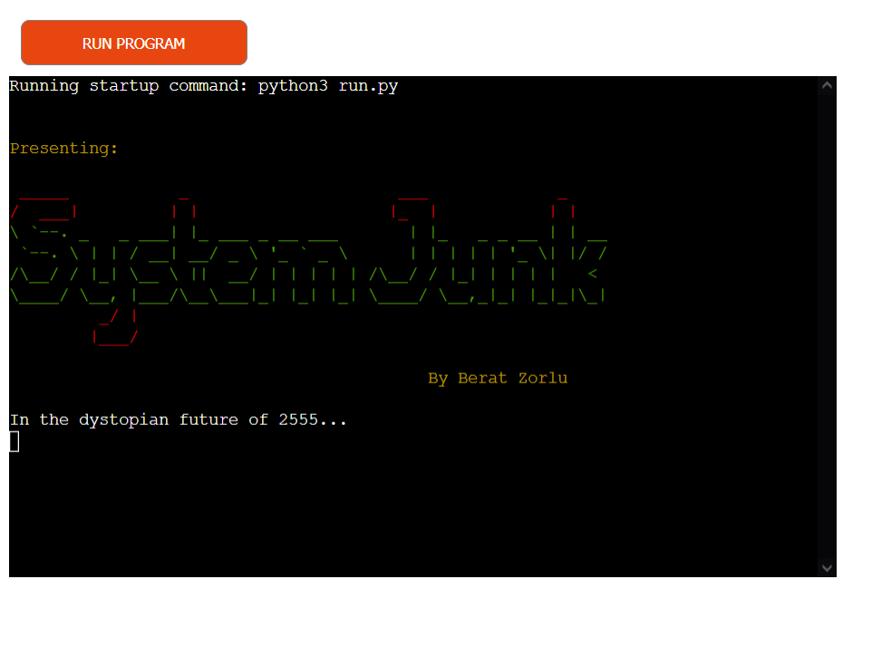

## [Link to live web application](https://system-junk.herokuapp.com/)

---

## Project Documentation
### Welcome to [System Junk](https://system-junk.herokuapp.com/)

Sytem Junk is quiz game application built as a part of Code Institute’s full-stack web development course curriculum. It utilises pure Python3 and a collection of libraries to expand on the functionality of the project.

The present documentation will provide information critical to understanding the core design principles that enabled the development of the project. More specifically, details regarding the UX/UI development, application testing and deployment, code structure and maintainability, bug fixes and the planned future features for the project.

---

## Table of Contents

-   [The Story](#the-story)
-   [User Experience (UX)](#user-experience-ux)
    -   [Target Audiance](#target-audiance)
    -   [Objectives](#objectives)
    -   [User Stories](#user-stories)
    -   [Colour Palette](#colour-palette)

- [Technical Design](#technical-design)
    -   [Flowchart](#flowchart)
    -   [Data Model](#data-model)

-   [Website Features](#website-features)
    -   [Application Elements](#application-elements)

-   [Future Features](#future-features) 

-   [Testing](#testing)
    -   [Manual Testing](#manual-testing) 

-   [Validation](#validation)
    -   [Python](#python)

-   [Bug Fixes](#bug-fixes)

-   [Deployment](#deployment)
    -   [Local Deployment](#local-deployment)
    -   [Heroku Deployment](#heroku-deployment)

-   [Technologies Used](#technologies-used)
    -   [Hardware](#hardware)
    -   [Software](#software)
    -   [Platforms](#platforms)
    -   [Libraries](#libraries)
        -   [Local Libraries](#local-libraries)
        -   [Third Party Libraries](#third-party-libraries)

-   [Credits and References](#credits-and-references)
    -   [Code Structure](#code-structure)
    -   [Library Information](#library-information)
    -   [Theory](#theory)

-   [Acknowledgements](#acknowledgements)

-   [Closing Remarks](#closing-remarks)

---

## The Story

The concept of this application regards a traditional quiz game. System Junk is based on a fictional dystopian narrative created specifically for this project. In the year 2555, the player is presented with a story world where world societies have abandoned all pursuits outside of science. This was a direct result of the expiry of various natural resources, forcing humankind to seek refuge in the benefits found through progressing scientific knowledge. While this approach allowed humanity to survive, cultures changed their fundamental approach to arts and humanities where they only view it as redundant practices. Earth's nations are far away from their state 500 years ago, and most are only mere communities. Because of this, people still depend on science to find solutions to solve their biggest problems, and they expect all individuals to invest all their time in this area.

More established societies have institutionalized this approach where every citizen is periodically tested on their knowledge of the fundamentals of science. Those who succeed in these assessments are granted further freedoms and living standards. Those who fail these tests, however, are removed from the mainstream margins of society and discarded to the outskirts of civilization with little to no rights to protect their humanity. Mainstream societies view these groups as unworthy of the full care of their governments, and label them as "System Junk." These outcast communities have since developed into organized societies that aim to take back their fundamental rights. The fate of the world is unknown, but with the emerging activity in outcast communities and the existance of an unyielding opression from mainstream socities, it is only plausible to expect nothing but a worldwide uprise brewing in the future to come.

---

## User Experience (UX)

### Target Audiance

This project targets the general audiance inclusive of all ages. It is reccomended that the players have at least a good comprehension of the English language and are familiar with quiz games.

### Objectives

User Objectives

- Experience an enjoyable and brief quiz game application.
- Be provided information regarding the rules of the quiz.
- Have the ability to submit performance information with a unique username.
- Be presented with a report of the user's unique overall performance in the game.

Developer Objectives

- Develop a game software that is straightforward to play.
- Create a gameplay environment where the purpose of the game is clear to the player.
- Ensure that the user receives feedback on the various processes that occur during the game.
- Provide a game aesthetic that is unique to the game.

### User Stories

User

-   As a user, I want to be presented with a clear welcome section.
-   As a user, I want to be able to learn about the story of the game.
-   As a user, I want to quickly learn how to play the game before it starts.
-   As a user, I want to be presented with questions that are clear and concise.
-   As a user, I want to be able to view my answer options.
-   As a user, I want to receive feedback from the game about the correctness of my answer.
-   As a user, I want to receive feedback from the game when I do something that is not allowed.
-   As a user, I want the game application to tell me what it is doing before and after the quiz completion.
-   As a user, I want to be able to view a report of my results.
-   As a user, I want to be able to provide a username to save my performance data.
-   As a user, I want to be able to see a report of my overall game performance when I complete the game.
-   As a user, I want to be asked if I want to play the game again before the application terminates.

Developer

-   As a developer, I want the user to learn about the game narrative before the application begins.
-   As a developer, I want users to be provided feedback from the system whenever a new critical process is running.
-   As a developer, I want usernames, final scores and final score percentages to be uploaded to Google Spreadsheets.
-   As a developer, I want the user to be warned if they input invalid data or provide an incorrect answer.
-   As a developer, I want user data to be subject to a data validation process to ensure the quality of data and the smooth run of the program.

### Colour Palette

[Coolors](https://coolors.co/) was a highly beneficial resource in this regard which provided significant help in identifying
matching colours that also have appropriate contrast.

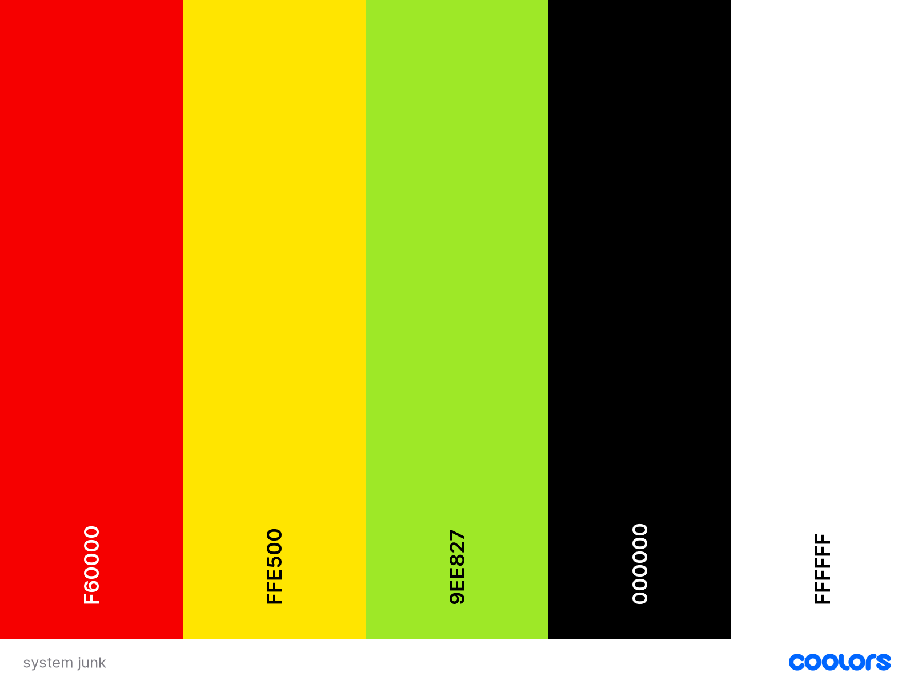

---

## Technical Design

### Flowchart
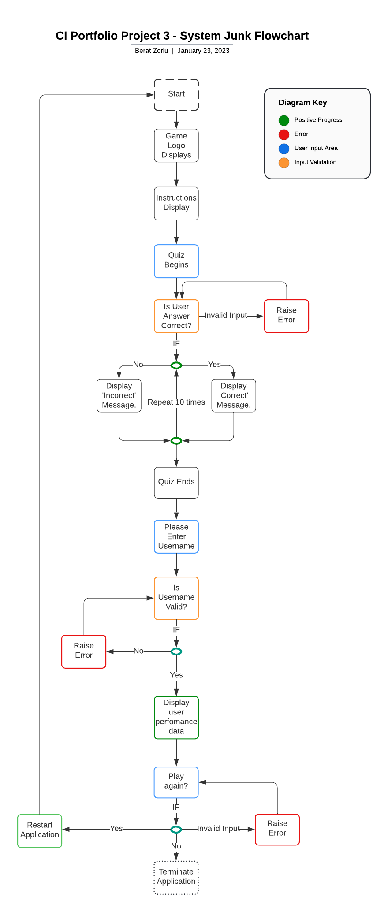

### Data Model

The data model of this application consists of compartmentalized code that is imported across different .py files to better manage the various functions in a manageable manner. The class structure present in the colours.py allows access to various colours with shortcuts that are specific to each colour. This way the predetermined elements in the Colorama library are shortened and made easy to access regarding the needs of this application.

As regards the quiz questions, a separate questions.py file is created to house all questions and choices of content to be used in the game. The logic of the code loops through both the QUIZ_QUESTIONS library and QUIZ_CHOICES list and prints these as a pair to the terminal. The correct answer is determined by comparing the question and answer key/value pair in the QUIZ_QUESTIONS list with the user input. Removing this section of the code from the run.py helped better manage the development process without making the code contained in the run.py file too crowded.

The database model of this project is arguably simple as the application itself did not require complex manipulation of user data. That being said, targeting specific and relevant data that the collection of which would add meaningful value to the application was a key consideration for the data model design. Thus, 3 data points, namely; 
    
    - username,
    - final score,
    - final score percentage

were identified as relevant to the goals of this project. This process is achieved by utilizing the combined functionality available in Google Drive API and Google Spreadheets API, where the application communicates with these services to upload relevant data to a target spreadsheet. Please find below a screenshot of the relevant Google Spreadsheet.

Screenshot

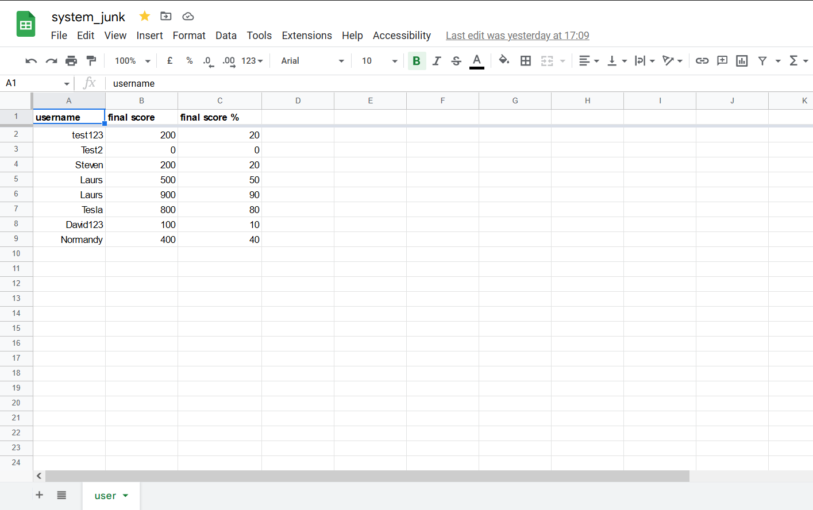

---

## Website Features

The design considerations that impacted the envisioned features were mainly structured around CLI-based considerations. While there were more features planned in the initial stages of the project, some were not entertained to the benefit of serving the needs referenced in the [User Stories](#user-stories) section. Thus, it was important to focus on a minimum viable project rather than prioritizing the implementation of further features for the sake of it. This would only bloat the application without adding much real value to the user experience overall.

### Application Elements

The below elements are available to be experienced by the user across the quiz game application as a whole.

#### Welcome Logo

#### Game Story

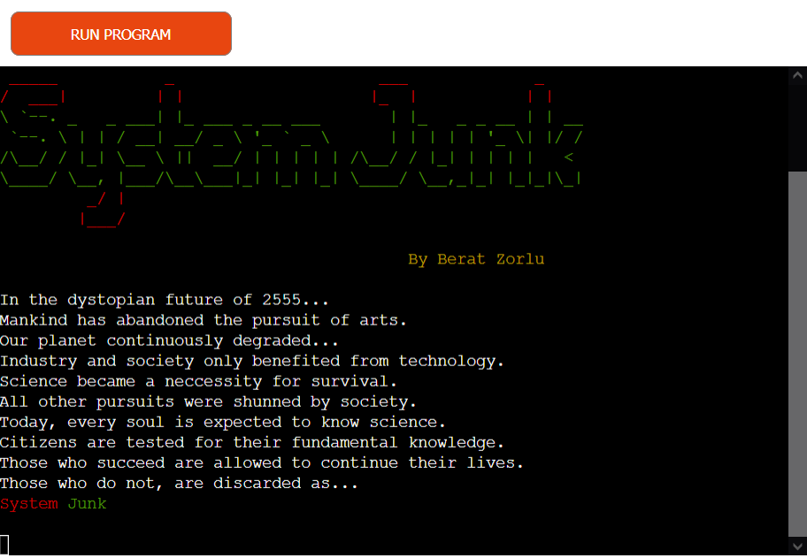

#### Game Instructions

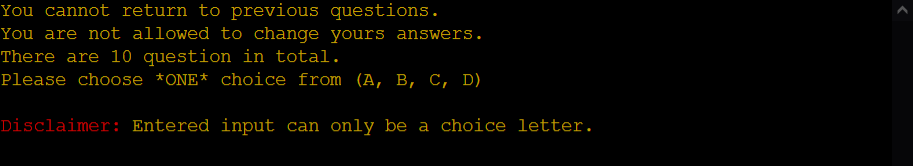

#### Questions & Choices

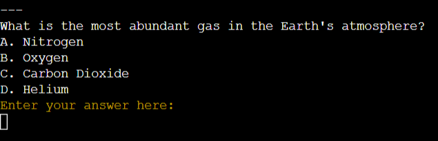

#### Answer Feedback

#### Username Input & Instructions

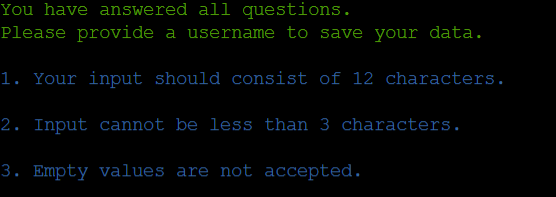

#### Quiz Results

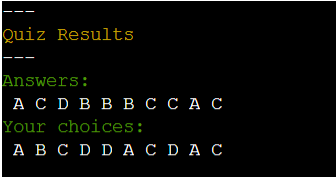

#### System Feedback

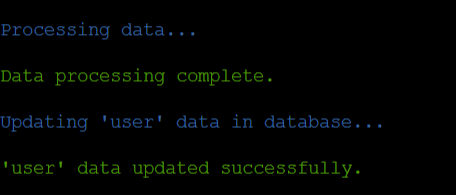

    There are many examples of the system feedback feature available throughout various sections 
    implemented in the application. As every instance of this feature serve the same purpose, 
    only one example is provided in the documentation to prevent repetition.

#### Player Performance

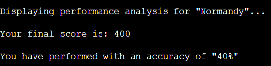

#### Game Restart

#### Quiz End 

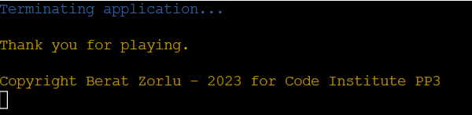

---

## Future Features

#### Leaderboard

- It is currently not possible to display a history of player data and compare the information in the database to structure a ranking system. However, the data already available in the Google Spreadsheets tied to the program is sufficient to implement this functionality. The development process for this project prioritized the completion of a minimum valuable product, thus removing a leaderboard feature from consideration. The future implementation of functionality like this would adequately expand upon its capacity to display information to the player.

#### Custom Performance Text

- Featuring specific text content sensitive to the overall performance of the player will add an additional level of interaction between the player and the game. Having the program detect and react to the final score of the user this way would present more opportunities for the player to replay the game to find out the different reactions the game features, thus, increasing overall replayability.

---

## Testing 

### Manual Testing

User Stories Testing

1. As a user, I want to be presented with a clear welcome section.

| **Feature**   | **Action**                    | **Expected Result**          | **Actual Result** |
| ------------- | ----------------------------- | ---------------------------- | ----------------- |
| Welcome Logo | Run application | Users are presented with a logo. | Functions as intended |

Screenshot

2. As a user, I want to be able to learn about the story of the game.

| **Feature**   | **Action**                    | **Expected Result**          | **Actual Result** |
| ------------- | ----------------------------- | ---------------------------- | ----------------- |
| Animated Story Text | Run application | Users are presented with an animated story section. | Functions as intended |

Screenshot

3. As a user, I want to learn how to play the game before it starts.

| **Feature**   | **Action**                    | **Expected Result**          | **Actual Result** |
| ------------- | ----------------------------- | ---------------------------- | ----------------- |
| Instruction Text | Run application | Users are presented with game instructions. | Functions as intended |

Screenshot

4. As a user, I want to be presented with questions that are clear and concise.

| **Feature**   | **Action**                    | **Expected Result**          | **Actual Result** |
| ------------- | ----------------------------- | ---------------------------- | ----------------- |
| Questions | Run application | Users are presented with questions. | Functions as intended |

Screenshot

5. As a user, I want to be able to view my answer options.

| **Feature**   | **Action**                    | **Expected Result**          | **Actual Result** |
| ------------- | ----------------------------- | ---------------------------- | ----------------- |
| Choices | Run application | Users are presented with choices. | Functions as intended |

Screenshot

6. As a user, I want to receive feedback from the game about the correctness of my answer.

| **Feature**   | **Action**                    | **Expected Result**          | **Actual Result** |
| ------------- | ----------------------------- | ---------------------------- | ----------------- |
| Answer Feedback | Input Answer | Users are presented with a feedback depending on whether they input the correct or incorrect answer. | Functions as intended |

Screenshot

7. As a user, I want to receive feedback from the game when I do something that is not allowed.

| **Feature**   | **Action**                    | **Expected Result**          | **Actual Result** |
| ------------- | ----------------------------- | ---------------------------- | ----------------- |
| Invalid Input Feedback | Enter Invalid Input | Users are notified when their input is not allowed by the system. | Functions as intended |

Screenshot

8. As a user, I want the game application to tell me what it is doing before and after the quiz completion.

| **Feature**   | **Action**                    | **Expected Result**          | **Actual Result** |
| ------------- | ----------------------------- | ---------------------------- | ----------------- |
| System Process Feedback | Run application | Users are presented with feedback from the system whenever a new process begins. | Functions as intended |

Screenshot

9. As a user, I want to be able to view a report of my answers.

| **Feature**   | **Action**                    | **Expected Result**          | **Actual Result** |
| ------------- | ----------------------------- | ---------------------------- | ----------------- |
| Quiz Answer Summary | Complete Quiz | Users are presented with a summary of their answers. | Functions as intended |

Screenshot

10. As a user, I want to be able to provide a username to save my performance data.

| **Feature**   | **Action**                    | **Expected Result**          | **Actual Result** |
| ------------- | ----------------------------- | ---------------------------- | ----------------- |
| Save Username and Score | Complete Quiz | Users are asked to provide a username. | Functions as intended |

Screenshot

11. As a user, I want to be able to see a report of my overall game performance when I complete the game.

| **Feature**   | **Action**                    | **Expected Result**          | **Actual Result** |
| ------------- | ----------------------------- | ---------------------------- | ----------------- |
| Performance Summary | Submit Username | Users are displayed their saved usernames, final scores and overall accuracy percentages. | Functions as intended |

Screenshot

12. As a user, I want to be asked if I want to play the game again before the application stops.

| **Feature**   | **Action**                    | **Expected Result**          | **Actual Result** |
| ------------- | ----------------------------- | ---------------------------- | ----------------- |
| Game Restart Prompt | Submit Username | Users are presented with a prompt to choose between restarting or terminating the application. | Functions as intended |

Screenshot

---

## Validation

### PYTHON

Code Institute's [Python Linter](https://pep8ci.herokuapp.com/) was the main resouce during the code validation process. The relevant code passes with overall success with occassional minor warnings.

PEP8 Validation: run.py

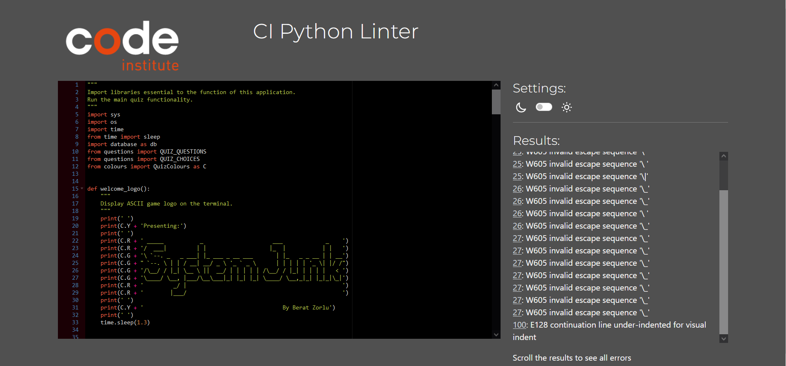
<ul><li>The errors detected for this file come from the ASCII art implemented to display the logo of the game. While these warnings can be avoided by removing the logo art, this would take away from the identity of the game. There is also an instance of indenting code for visual purposes which helped keep the lines 100-101 from being too long.</li></ul>

PEP Validatation: questions.py

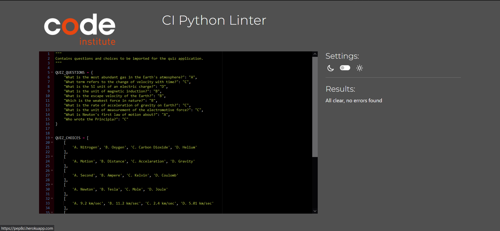

PEP Validatation: colours.py

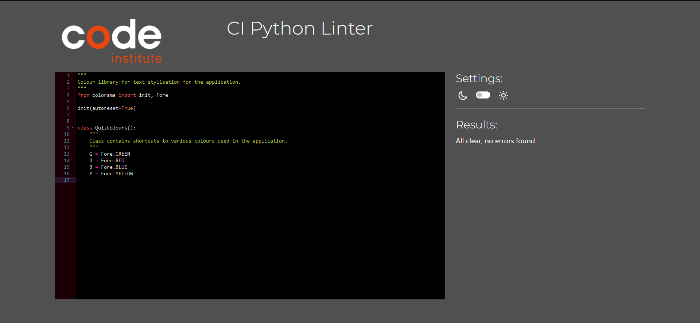

PEP Validatation: database.py

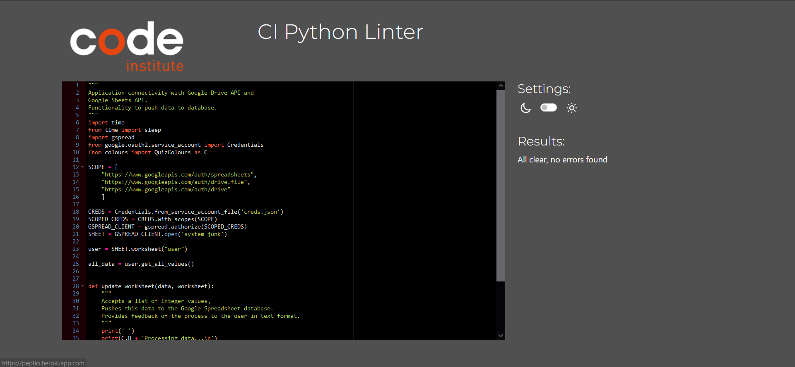

---    

## Bug Fixes

In this section, all bugs that cased fatal errors that prevented the successful execution of the application and their relevant fixes are provided.

| **Bug** | **Fix** |
| ------- | ------- |
| get_username() 'None' Text Display: A bug where a 'None' text appeared during when the system was expecting input from the user for their username. | Fixed by removing the print element nested inside an outer input element. Click [here](https://github.com/beratzorlu/python-quiz/commit/d3fc300dc47d88aecd65f99b7ab7cbb6ca6f13b7) to review the relevant commit. |
| Unexpected Game Restart Bug: A bug causing the game to restart the game automatically without asking for input after the user chooses to restart the game at their first go. | Fixed by removing the while loop in the main() function. Click [here](https://github.com/beratzorlu/python-quiz/commit/8e7f2c66ffeeeeec7f6998f9da32b7d5518b647e) to review the relevant commit. |
| Invalid Question Answer Bug: A bug where the application would accept input other than A, B, C, or D and register it as an incorrect answer. | Fixed by adding two seperate functions that accept and then validate the user input before passing it to answer check process. Click [here](https://github.com/beratzorlu/python-quiz/commit/c201cb2e448cf5d6f93e1de7d2fe05eb9b4351a3) to review the relevant commit. |

---

## Deployment

This application has been deployed by using the Heroku cloud platform. Please find below the neccessary procdures to replicate the deployment process.

You can find a [template](https://github.com/Code-Institute-Org/python-essentials-template) prepared by Code Institute that is designed to display this backend application in a modern web browser. This allows the project to be accessible for users without the need of any third party software other than an Internet browser application.

### Local Deployment 

Gitpod IDE is the development environment for this project.

If you wish to make copy of this repository locally, you can clone it by inputting the following code into your preferred integrated development environment (IDE):
- `git clone https://github.com/beratzorlu/python-quiz.git`

As anoher method, you can click below button to create your own workspace using this repository if you are using Gitpod.e

### Heroku Deployment

This project utilizes the services available at [Heroku](https://www.heroku.com). Heroku is a platform as a service (PaaS) that allows users to build, deploy, and control applications in a cloud environment.

Disclaimer: To be able successfully replicate the Heroku deployment process, it is highly reccomended that users setup an account on the platform prior to following the steps provided below.

- Select *New* in the top-right corner of your Heroku Dashboard after log-in.
- Select navigate to the *Create new app* button from the dropdown menu and select it.
- Assign a unique name to your application.
- Navigate to the *region* dropdown menu and select the region closest to you from either EU or USA. 
- Select *Create App*.
- Navigate to your newly created application and select *Settings*. 
- Click *Reveal Config Vars*.
- Add first *Config Var*.
- Set the value of KEY to `CREDS`, copy and paste the data in your credentials file (ie. creds.json) into the value area.
- Add second *Config Var*.
- Set the value of KEY to `PORT`, and the value to `8000` then select *add*.
- You need to add support to dependencies to be able to successfully deploy application, select *Add Buildpack*.
- The order in which you list your dependencies is critical, select `Python` as the first dependency.
- From the same menu, select `Node.js` after you select `Python`. (You can drag the list items upwards and downwards to change their order if needed.)
- Scroll until you find your desired deployment method, select `Enable Automatic Deploy` to rebuild your project automatically every time you push a new commit. Select `Manual Deployment` to manually deploy from your desired branch on will.*

*If you have selected automatic deployment, your application will only deploy after your first push to the system.

After the completion of this process, Heroku needs two files further to deploy successfully. These are;
    - requirements.txt
    - Procfile

To install your project's requirements use: `pip3 install -r requirements.txt`. 

If you have third party packages in your project the requirements file needs updated, use: `pip3 freeze --local > requirements.txt`

To create your Procfile, use: `echo web: node index.js > Procfile`

For Heroku deployment, follow these steps to connect your GitHub repository to the newly created app:

- In the Terminal (CLI), connect to Heroku using this: `heroku login -i`
- Set the remote for Heroku: `heroku git:remote -a <app_name>` (replace <app_name> with your chosen name for your application without the angle-brackets)
- Input commands `git add`, `git commit`, and `git push` to GitHub sequentially.
- Finally, type `git push heroku main` in the terminal to connect to Github.

Alternatively, you can connect to your Github account by following the below steps on Heroku's platform.

- Navigate to your Heroku account dashboard.
- Find the relevant project and click on its icon.
- On the next page, navigate to the `Deploy` subsection.
- Scroll down until you find `Deployment method` and find `Use Github`.
- Finally, input your Github account credentials to complete the process. 

---

## Technologies Used

### Hardware

- Monster Abra A5 V13.4 15.6" Laptop
- Lenovo IdeaPad 3i 14" Laptop
- Samsung VA 1920x1080 144Hz Curved Gaming Monitor
- iPhone 11
- Ipad Air 5th Generation
- Samsung A51

### Software

- Mozilla Firefox: Main browser used for development, testing and device simulation.
- Google Chrome: Secondary browser for testing and device simulation.
- Microsoft Edge: Tertiary browser for testing.
- Firefox Mobile: Mobile testing of the deployed site.
- Chrome Mobile: Mobile testing of the deployed site.
- Safari Mobile: Mobile testing of the deployed site.
- Windows Snip & Sketch: Capturing screenshots for readme and archiving identified bugs.
- Microsoft Snipping Tool: Fallback screen capture software when MS Snip & Sketched became unresponsive.
- DiffChecker: Comparing code to identify issues, solutions and ideas.
- Python Checker: Checking the syntax of Python code.
- Patorjk: Generating custom ASCII art.

### Platforms

- GitHub: Version control and site deployment.
- GitPod: Integrated Development Environment (IDE) chosen for this project.
- Google Fonts: Finding and exporting third-party fonts for the website.
- CodePen: For quickly testing out ideas before carrying them to 
DevTools.
- Coolors: For creating a matching colour palette that has appropriate contrast.
- Google Cloud: For accessing a library of Google-based API services.
- Google Drive API: For communicating with a cloud service to upload data.
- Google Sheets API: For reading and writing automated data to a cloud-hosted spreadsheet file.

### Libraries

#### Local Libraries

os - Used to clear terminal.
sys, sleep, time - Used to create a typing effect in various sections of the application.

#### Third Party Libraries

Colourama - Used to provide colour to the text used in the application to provide visual stimulation as vanilla Python lacks this functionality.

Gspread - Used to upload user data to a cloud-based database as vanilla Python lacks this functionality.

---

## Credits and References

### Code Structure

- [Code Institute](https://codeinstitute.net/): I would like to thank Code Institute for their support and guidance throughout the development of this project.
    - The [Love Sandwiches](https://github.com/beratzorlu/love-sandwiches) was instrumental in learning how to connect to Google Drive and Google Spreadsheets API services, how to define scope in the code in regards to API, connecting Python code with cloud platforms to upload and pull data, and creating user input validation processes.

- [Bro Code](https://www.youtube.com/@BroCodez): This YouTube channel has been helpful in building the core logic of a Python-based quiz game. The videos specified below has been the primary source of inspiration in the development process of this project. 

    - [QUIZ GAME written in Python](https://www.youtube.com/watch?v=zehwgTB0vV8)
    - [Python quiz game](https://www.youtube.com/watch?v=yriw5Zh406s)

- [Aleksandracodes](https://github.com/aleksandracodes/CI_PP3_Connect4#libraries): This project has been highly inspirational in understanding how to implement testing procedures for the program functionality, how to import third party libraries, compartmentalising code into seperate files, and using class structures to create shortcuts to various third party functionality (ie. creating a class to have shorthand access to colours in colorama).

- [Adamgilroy22](https://github.com/adamgilroy22/python-hangman): This repository provided valuable understanding regarding how to approach to structuring documentation for this project.

- [W3Schools](https://www.w3schools.com/): This website has been key in understanding and getting further practice with various approaches to coding with Python3.
    - [Python Iterators](https://www.w3schools.com/python/python_iterators.asp)

- [Stack Overflow](https://stackoverflow.com/): This project heavily made use of Stack Overflow for troubleshooting problems that occurred throughout the development process. Below is are entries used to supplament this project.
    - [Indentation Error In Python Caused By Unidentitfied Reason](https://stackoverflow.com/questions/75159904/indentation-error-in-python-caused-by-unidentitfied-reason?noredirect=1#comment132631154_75159904) (Own Post: Post has been closed at the time of writing this documentation.)
    - [Randomised Quiz Using Dictionary](https://stackoverflow.com/questions/39605919/how-do-i-create-a-randomised-quiz-using-a-dictionary) (The post is active at the time of writing this documentation.)
    - [Why Does "a == x Or y or z" Always Evaluate To True? How Can I Compare "a" To All Of Those?](https://stackoverflow.com/questions/20002503/why-does-a-x-or-y-or-z-always-evaluate-to-true-how-can-i-compare-a-to-al) (The post is active at the time of writing this documentation.)
    - [If An Exception Is Raised Ask Again For Input](https://stackoverflow.com/questions/21943973/if-an-exception-is-raised-ask-again-for-input) (The post is active at the time of writing this documentation.)
    - [Typing Effect in Python](https://stackoverflow.com/questions/20302331/typing-effect-in-python) (The post is active at the time of writing this documentation.)

- [freecodecamp](https://www.freecodecamp.org/): This platform has been helpful in learning about various functionality and use-cases in Python.
    - [How to Get The Size of a List](https://www.freecodecamp.org/news/python-list-length-how-to-get-the-size-of-a-list-in-python/)
    - [How to Use the Does Not Equal Operator](https://www.freecodecamp.org/news/python-not-equal-how-to-use-the-does-not-equal-operator/ )

- [Real Python](https://realpython.com/): Python tutorials available on this platform were helpful in understanding how to build a quiz game with Python.
    - [Identity vs Equality](https://realpython.com/python-is-identity-vs-equality/)
    - [Python Quiz Application](https://realpython.com/python-quiz-application/#step-4-separate-data-into-its-own-file)

- [Python Examples](https://pythonexamples.org): This platform was useful in understanding how to use various data structures available in Python.
    - [List of Dictionaries](https://pythonexamples.org/python-list-of-dictionaries/)

- [Brittanica](https://www.britannica.com/): This website includes a myriad of quiz applications tailored for an expansive collection of subjects.
    - [All About Physics Quiz](https://www.britannica.com/quiz/all-about-physics-quiz)

- [Make Use Of](https://www.makeuseof.com): This website had useful information in understanding how to build an interactive quiz game using Python.
    - [Python Make Interactive Quiz Game](https://www.makeuseof.com/python-make-interactive-quiz-game/#how-to-create-the-python-script-and-add-your-first-quiz-question)

- [Programiz](https://www.programiz.com): This website was helpful in understanding how to effectively implement if statements into the project.
    - [If Elif Else](https://www.programiz.com/python-programming/if-elif-else)

- [Bobbyhadz](https://bobbyhadz.com): Information available in this blog was useful in learning about how to handle invalid user input.
    - [Python Prevent Empty User Input](https://bobbyhadz.com/blog/python-prevent-empty-user-input)

- [Official Python Website](https://www.python.org/): The official Python website was central in understanding how to correctly use various concepts while with this language.
    - [Top Level Environment](https://docs.python.org/3/library/__main__.html)

- [Digital Ocean](https://www.digitalocean.com): This website presented valuable information in understanding how to feature a text typing animation.
    - [Python Time Sleep](https://www.digitalocean.com/community/tutorials/python-time-sleep)

- [napoleon](https://sphinxcontrib-napoleon.readthedocs.io/en/latest/index.html): This website was helpful in understanding how to write effective docstrings in my Python code.
    - [Docstrings Guide](https://sphinxcontrib-napoleon.readthedocs.io/en/latest/example_google.html)

### Library Information

- [The Python Package Index (PyPI)](https://pypi.org/): PyPI was critical in accessing libraries that added functionality to the project that otherwise would be impossible to feature in the end product.
    - [Colorama Documentation](https://pypi.org/project/colorama/)

- [Tech With Tim](https://www.youtube.com/@TechWithTim): This YouTube channel was helpful understanding how to successfully install the Colorama library.
    - [How To Print Colored Text in Python (Colorama Tutorial)](https://www.youtube.com/watch?v=u51Zjlnui4Y)

- [Code Insitute](https://codeinstitute.net/ie/): The theory available in the Code Institute curriculum has been central in successfully setting up and utilizing Google Cloud API services for this project.

### Theory

- [UCD Professional Academy](https://www.ucd.ie/professionalacademy/): I would like to thank UCD PA for their facilitator and masterclass sessions in partnership with Code Insitute. These have been invaluable in better understanding relevant theory and practice elements.

---

## Acknowledgements

I would like to first and foremost thank my mentor, Rohit Sharma, for his dedication to helping me find direction in developing my projects and understand the fundamental considerations in growing as a software developer. Moreover, the tutor support available at Code Institute has been an excellent help in finding solutions to various issues I came across in the development process that I needed help. Lastly, the Slack community at Code Institute has been nothing less than inspirational. I commend their dedication to a constructive culture that strives to help future developers in their struggles towards their software development journey. 

--- 

## Closing Remarks

In closing, it is indubitable that there have been more obstacles in the development process of this project compared to my previous projects. While it was more straightforward to plan and implement various ideas for this project, the lack of a need to worry about front-end development has proven to be a challenge. Not being able to see the impact of the changes I made in my code in a visual medium was something I needed to adapt to before anything else. However, this issue progressively resolved itself the more time I spent reading and writing code. Studying documentation and the work of other developers were also important activities that allowed me to learn different perspectives that I would not have had exposure to by solely depending on relevant theory. Thus, the core learning point I have learned in developing this project is that, while it is inevitable for a developer to come across a significant issue in their project, no obstacle is big enough to be unsolvable. Taking an incremental approach, looking at the problem area in a granular fashion and studying how smaller blocks of code affect the larger functionality of an application, has proven to be the most sustainable approach to solving problems in my development process overall. I will be carrying this knowledge with me in the following projects of my career. In cases where resolution seems to be possible it is never too late to ask for help from others and continue research.

---
 [Back to Top](#table-of-contents)