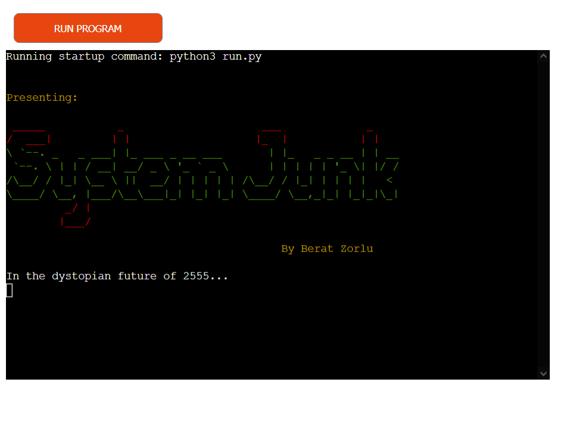

# System Junk – Portfolio Project 3

## [Link to live web application](https://system-junk.herokuapp.com/)

---

## Project Documentation
### Welcome to [System Junk](https://system-junk.herokuapp.com/)

---

## Table of Contents

-   [User Experience (UX)](#user-experience-ux)
    -   [Objectives](#objectives)
    -   [User Stories](#user-stories)

-   [Design Process](#design-process)
    -   [User Experience Design (UXD)](#user-experience-design-uxd)
    -   [Colour Palette](#colour-palette)

-   [Website Features](#website-features)
    -   [Shared Elements](#shared-elements)

-   [Future Features](#future-features) 

-   [Testing](#testing)
    -   [User Stories Testing](#user-stories-testing) 

-   [Validation](#validation)
    -   [Python](#python)
-   [Bug Fixes](#bug-fixes)

-   [Deployment](#deployment)

-   [Technologies Used](#technologies-used)
    -   [Hardware](#hardware)
    -   [Software](#software)
    -   [Platforms](#platforms)

-   [Credits and References](#credits-and-references)

-   [Closing Remarks](#closing-remarks)

---

## User Experience (UX)

### Objectives

User Objectives

- Experience an enjoyable and brief quiz game application.
- Be provided information regarding the rules of the quiz.
- Have the ability to submit performance information with a unique username.
- Be presented with a report of the user's unique overall performance in the game.

Developer Objectives

- Develop a game software that is straightforward to play.
- Create a gameplay environment where the purpose of the game is clear to the player.
- Ensure that the user receives feedback on the various processes that occur during the game.
- Provide a game aesthetic that is unique to the game.

### User Stories

User Stories

User

-   As a user, I want to be presented with a clear welcome section.
-   As a user, I want to be able to learn about the story of the game.
-   As a user, I want to learn how to play the game before it starts.
-   As a user, I want to be able to find instructions that are easy to understand.
-   As a user, I want to be presented with questions that are clear and concise.
-   As a user, I want to be able to view my answer options.
-   As a user, I want to receive feedback from the game about the correctness of my answer.
-   As a user, I want to receive feedback from the game when I do something that is not allowed.
-   As a user, I want the game application to tell me what it is doing before and after the quiz completion.
-   As a user, I want to be able to view a report of my results.
-   As a user, I want to be able to provide a username to save my performance data.
-   As a user, I want to be asked if I want to play the game again before the application stops.

Developer

-   As a developer, I want the user to learn about the game narrative before the application begins.
-   As a developer, I want users to be provided feedback from the system whenever a new critical process is running.
-   As a developer, I want usernames, final scores and final score percentages to be uploaded to Google Spreadsheets.
-   As a developer, I want the user to be warned if they input invalid data or provide an incorrect answer.
-   As a developer, I want user data to be subject to a data validation process to ensure the quality of data and the smooth run of the program.

---

## Design Process

### User Experience Design (UXD)

- ### Strategy 

- ### Scope

- ### Structure

- ### Skeleton

- ### Surface

---

### Colour Palette

[Coolors](https://coolors.co/) was a highly beneficial resource in this regard which provided significant help in identifying
matching colours that also have appropriate contrast.

---

## Website Features

The design considerations that impacted the envisioned features were mainly structured around conventional website design. While there were more features planned in the initial stages of the project, some were not entertained to the benefit of serving the needs referenced in the [User Stories](#user-stories) section. Thus, it was important to focus on a minimum viable project rather than prioritizing the implementation of further features for the sake of it. This would only bloat the website without adding much value to the user experience overall.

### Shared Elements

The below elements are available to be experienced by the user across the website as a whole.

---

## Future Features

---

## Testing 

- ### User Stories Testing 

---

## Validation

### PYTHON

---    

## Bug Fixes

---

## Deployment

---

## Technologies Used

### Hardware

- Monster Abra A5 V13.4 15.6" Laptop
- Samsung VA 1920x1080 144Hz Curved Gaming Monitor
- iPhone 7 Plus
- Samsung Galaxy A51

### Software

- Mozilla Firefox: Main browser used for development, testing and device simulation.
- Google Chrome: Secondary browser for testing and device simulation.
- Microsoft Edge: Tertiary browser for testing.
- Firefox Mobile: Mobile testing of the deployed site.
- Chrome Mobile: Mobile testing of the deployed site.
- Safari Mobile: Mobile testing of the deployed site.
- GIMP: Used for converting .jpg and .png files to .webp for site optimization.
- Balsamiq: Used for wireframing.
- Windows Snip & Sketch: Capturing screenshots for readme and archiving identified bugs.
- Microsoft Snipping Tool: Fallback screen capture software when MS Snip & Sketched became unresponsive.

### Platforms

- GitHub: Version control and site deployment.
- GitPod: Integrated Development Environment (IDE) chosen for this project.
- Pexels: Primary source for high-quality royalty-free images.
- Pixabay: Secondary source for high-quality royalty-free images.
- Google Fonts: Finding and exporting third-party fonts for the website.
- CodePen: For quickly testing out ideas before carrying them to 
DevTools.
- Font Awesome: For importing fonts to further decorate text elements.
- Coolors: For creating a matching colour palette that has appropriate contrast.
- Code Beautify: For looking for differences between two pieces of code. This helped me identify my mistakes.

---

## Credits and References

--- 

## Closing Remarks

---
 [Back to Top]()