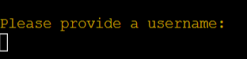

# System Junk – Portfolio Project 3

## [Link to live web application](https://system-junk.herokuapp.com/)

---

## Project Documentation
### Welcome to [System Junk](https://system-junk.herokuapp.com/)

Sytem Junk is quiz game application built as a part of Code Institute’s full-stack web development course curriculum. It utilises pure Python3 and a collection of libraries to expand on the functionality of the project.

The present documentation will provide information critical to understanding the core design principles that enabled the development of the project. More specifically, details regarding the UX/UI development, application testing and deployment, code structure and maintainability, bug fixes and the planned future features for the project.

---

## Table of Contents

-   [The Story](#thestory)
-   [User Experience (UX)](#user-experience-ux)
    -   [Objectives](#objectives)
    -   [User Stories](#user-stories)

-   [Design Process](#design-process)
    -   [User Experience Design (UXD)](#user-experience-design-uxd)
    -   [Colour Palette](#colour-palette)

-   [Website Features](#website-features)
    -   [Shared Elements](#shared-elements)

-   [Future Features](#future-features) 

-   [Testing](#testing)
    -   [User Stories Testing](#user-stories-testing) 

-   [Validation](#validation)
    -   [Python](#python)
-   [Bug Fixes](#bug-fixes)

-   [Deployment](#deployment)

-   [Technologies Used](#technologies-used)
    -   [Hardware](#hardware)
    -   [Software](#software)
    -   [Platforms](#platforms)

-   [Credits and References](#credits-and-references)

-   [Closing Remarks](#closing-remarks)

---

## The Story

The concept of this application regards a traditional quiz game. System Junk is based on a fictional dystopian narrative created specifically for this project. In the year 2555, the player is presented with a story world where world societies have abandoned all pursuits outside of science. This was a direct result of the expiry of various natural resources, forcing humankind to seek refuge in the benefits found through progressing scientific knowledge. While this approach allowed humanity to survive, cultures changed their fundamental approach to arts and humanities where they only view it as redundant practices. Earth's nations are far away from their state 500 years ago, and most are only mere communities. Because of this, people still depend on science to find solutions to solve their biggest problems, and they expect all individuals to invest all their time in this area.

More established societies have institutionalized this approach where every citizen is periodically tested on their knowledge of the fundamentals of science. Those who succeed in these assessments are granted further freedoms and living standards. Those who fail these tests, however, are removed from the mainstream margins of society and discarded to the outskirts of civilization with little to no rights to protect their humanity. Mainstream societies view these groups as unworthy of the full care of their governments, and label them as "Space Junk." These outcast communities have since developed into organized societies that aim to take back their fundamental rights. The fate of the world is unknown, but with the emerging activity in outcast communities, it is only plausible to expect nothing but a worldwide uprise brewing in the future to come.

---

## User Experience (UX)

### Objectives

User Objectives

- Experience an enjoyable and brief quiz game application.
- Be provided information regarding the rules of the quiz.
- Have the ability to submit performance information with a unique username.
- Be presented with a report of the user's unique overall performance in the game.

Developer Objectives

- Develop a game software that is straightforward to play.
- Create a gameplay environment where the purpose of the game is clear to the player.
- Ensure that the user receives feedback on the various processes that occur during the game.
- Provide a game aesthetic that is unique to the game.

### User Stories

User

-   As a user, I want to be presented with a clear welcome section.
-   As a user, I want to be able to learn about the story of the game.
-   As a user, I want to learn how to play the game before it starts.
-   As a user, I want to be able to find instructions that are easy to understand.
-   As a user, I want to be presented with questions that are clear and concise.
-   As a user, I want to be able to view my answer options.
-   As a user, I want to receive feedback from the game about the correctness of my answer.
-   As a user, I want to receive feedback from the game when I do something that is not allowed.
-   As a user, I want the game application to tell me what it is doing before and after the quiz completion.
-   As a user, I want to be able to view a report of my results.
-   As a user, I want to be able to provide a username to save my performance data.
-   As a user, I want to be asked if I want to play the game again before the application stops.

Developer

-   As a developer, I want the user to learn about the game narrative before the application begins.
-   As a developer, I want users to be provided feedback from the system whenever a new critical process is running.
-   As a developer, I want usernames, final scores and final score percentages to be uploaded to Google Spreadsheets.
-   As a developer, I want the user to be warned if they input invalid data or provide an incorrect answer.
-   As a developer, I want user data to be subject to a data validation process to ensure the quality of data and the smooth run of the program.

---

### Colour Palette

[Coolors](https://coolors.co/) was a highly beneficial resource in this regard which provided significant help in identifying
matching colours that also have appropriate contrast.

---

## Website Features

The design considerations that impacted the envisioned features were mainly structured around CLI-based considerations. While there were more features planned in the initial stages of the project, some were not entertained to the benefit of serving the needs referenced in the [User Stories](#user-stories) section. Thus, it was important to focus on a minimum viable project rather than prioritizing the implementation of further features for the sake of it. This would only bloat the application without adding much real value to the user experience overall.

### Application Elements

The below elements are available to be experienced by the user across the quiz game application as a whole.

#### Welcome Logo

#### Game Story

#### Game Instructions

#### Questions & Choices

#### Answer Feedback

#### Username Input & Instructions

#### Quiz Results

#### System Feedback

    There are many examples of the system feedback feature available throughout various sections 
    implemented in the application. As every instance of this feature serve the same purpose, 
    only one example is provided in the documentation to prevent repetition.

#### Player Performance

#### Game Restart

#### Quiz End 

---

## Future Features

#### Leaderboard

- It is currently not possible to display a history of player data and compare the information in the database to structure a ranking system. However, the data already available in the Google Spreadsheets tied to the program is sufficient to implement this functionality. The development process for this project prioritized the completion of a minimum valuable product, thus removing a leaderboard feature from consideration. The future implementation of functionality like this would adequately expand upon its capacity to display information to the player.

---

## Testing 

- ### User Stories Testing 

---

## Validation

### PYTHON

---    

## Bug Fixes

---

## Deployment

---

## Technologies Used

### Hardware

- Monster Abra A5 V13.4 15.6" Laptop
- Samsung VA 1920x1080 144Hz Curved Gaming Monitor
- iPhone 7 Plus
- Samsung Galaxy A51

### Software

- Mozilla Firefox: Main browser used for development, testing and device simulation.
- Google Chrome: Secondary browser for testing and device simulation.
- Microsoft Edge: Tertiary browser for testing.
- Firefox Mobile: Mobile testing of the deployed site.
- Chrome Mobile: Mobile testing of the deployed site.
- Safari Mobile: Mobile testing of the deployed site.
- GIMP: Used for converting .jpg and .png files to .webp for site optimization.
- Balsamiq: Used for wireframing.
- Windows Snip & Sketch: Capturing screenshots for readme and archiving identified bugs.
- Microsoft Snipping Tool: Fallback screen capture software when MS Snip & Sketched became unresponsive.

### Platforms

- GitHub: Version control and site deployment.
- GitPod: Integrated Development Environment (IDE) chosen for this project.
- Pexels: Primary source for high-quality royalty-free images.
- Pixabay: Secondary source for high-quality royalty-free images.
- Google Fonts: Finding and exporting third-party fonts for the website.
- CodePen: For quickly testing out ideas before carrying them to 
DevTools.
- Font Awesome: For importing fonts to further decorate text elements.
- Coolors: For creating a matching colour palette that has appropriate contrast.
- Code Beautify: For looking for differences between two pieces of code. This helped me identify my mistakes.

---

## Credits and References

--- 

## Closing Remarks

---
 [Back to Top]()